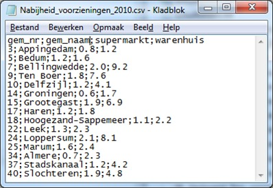

Networking Tricks with the Linux Kernel
=======================================

http://johntellsall.com/networking-tricks

INBOX
=====

* Q: what happens if your process exits w/o closing the socket?
* Docker containers
* Netlink
* `AF_UNIX sockets and the abstract namespace, inter-process communication <http://blog.eduardofleury.com/archives/2007/09/13>`_ by Eduardo Fleury
* what _is_ the kernel? http://lwn.net/Articles/534682/

* http://highscalability.com/blog/2014/2/12/paper-network-stack-specialization-for-performance.html

Me
==

* Senior web/server consultant; DevOps
* 20 years experience with Python
* john@johntellsall.com

☃
=

Themes
======

apps talk to other apps

.. note::

   There are tons of kernel structures to make this happen -- we'll cover about a dozen types tonight.

   Many are unknown or have subtle details. 

   It looks like it works one way, but there are important differences.
   
   and... DETAILS MATTER!

.
===============
.. figure:: _static/css-is-awesome-700x375.jpg
   :class: fill

.. note::
   details matter!

choose your own tradeoffs
=========================

*How* apps talk to each other matters:

* system does work => simpler code

* *you* know your app best

.. note::

   * instead of “one size fits all” use specific features that fit your app

       => theme: concept doesn’t match implementation

this talk
=========

* overview
* everything we know is wrong
* tricks and awesomeness
* other directions

Q: what types of IPC are there?
===============================

Overview of Sockets
===========================

Two (or more) processes, address for each, connection-oriented or
connectionless

.. note::
   Everyone knows this stuff, but there’s a lot of details which can be subtle, or awesome.

tail -f syslog | egrep ERR
===================================

good old *pipes*

* connection-oriented
* address: anonymous (or path)
* one-way reliable stream of bytes
* bytes consumed by sink

.. note::
   JM diagram

trick: file path = network
==========================

*named pipes* are awesome

anything with a *file address* (ie: path), can be connected to
anything that expects a file

Postgres import from stream
===========================

    ``mkfifo --mode=0666 /tmp/pipe``

    ``psql -c "COPY x.x FROM '/tmp/pipe'``

    ``gunzip < data.gz > /tmp/pipe``

.. note::
   /tmp/pipe is an *address* (file path)

   JM diagram

Internet sockets
================

TCP socket
==========

.. note::
   Metaphor is a “pipe”: path with two endpoints -- connection oriented
   -- reliable ordered stream of bytes.

   Usage: client connects to endpoint on server, transfer data back and forth

   Example: used for web and tons of stuff.

   * connection-oriented
   * address: anonymous (or path)
   * one-way reliable stream of bytes
   * bytes consumed by sink
   * difference from pipes: bidirectional
   * difference: on each end is an “address”: IP address, a (TCP) port

TCP features
===============================================

* automatic flow control
* split/join packets
* *drawback:* latency

more: "Hello, would you like to hear a TCP joke?"

.. note:

   Used everywhere because it does a ton of stuff:

UDP socket
==========

Usage: short send/receive (DNS), or fast unreliable one-way data like
Skype, or statistics

Example: Domain Name Service (DNS) -- send short string (hostname) to well-known UDP address, get a short response (IP number)

Metaphor is a “postcard”: a little bit of data going from one street address to another. Like postcards, UDP packets can be received out of order or not at all, you will never know if a packet arrived or not. You can also get duplicate packets. 

* address: IP and port number, but not the same as TCP ports!
* connectionless
* fast
* low latency

* small packets not bytes, around 1.5KB
* unreliable: drops, dups, reordering
* multicast is awesome

JM: graphic of crazed TMCM

How do you know what went wrong?
================================

* server isn't up
* wrong IP / port
* bad router
* satellite link
* overloaded server

.. note::
   theme: details matter!

Answer
=======

.. note::

   A: no response, so you’ll never know!

   theme: best tool for the job

Detail: UDP vs TCP
==================

which is better?

.. note::
   connection oriented isn’t always the best: can’t interrupt
   data flow; CPU has to examine each and every byte to figure out
   where messages begin and end

   JM diagram

Detail: UDP pseudo-connections
==============================

Q: for connectionless protocols (UDP), how does server know who to
send response to?

.. note::
   UDP: how do you know who sent you a packet?

Answer
======

A: kernel gives you user data, but there’s also other data available
in the network headers

.. note::
   server bind: s.bind((HOST, PORT))
   server: data,addr = s.recvfrom(1024)

   client send: s.sendto(msg, (host, port))
   client: reply,addr = s.recvfrom(1024)

   (JM: how?)  IP header has client’s IP.
   (JM: what about UDP port?)
   (JM: example UDP “send to client”)

UDP multicast
=============

Q: who uses Publish/Subscribe with Redis or ZeroMQ?

Example: Facebook/Twitter updates. Reads are common, writes are
rare. When account gets a new update, all his friends are sent an
update

=> we can replace some of these use cases with UDP multicast, on many machines!

Metaphor: radio with channels
Most protocols are two point streams of bytes or packets; UDP multicast is one-to-many
(or many to many) metaphor: radio with channels: multiple switchable stations, each one broadcasting to many people, unreliable. 

In practice: this could be used for statistics

Unix domain sockets
===================

* best of all worlds
* common: connection-oriented reliable stream of bytes, like TCP but same machine only
* secure: data doesn’t travel across a network
* similar to pipe: AF: path, Linux Abstract “later”
* like TCP: bidirectional
* fast
* low latency
* can _choose_ speed vs inorder, connection vs connectionless

later: http://www.thomasstover.com/uds.html

Detail: Linux has packet-based Unix sockets!
Detail: and sequential packets
Detail: and… multicast!

Woot
====

This means that if you have two or more processes on the same machine,
you have a wide range of options, including skipping distributed
queues like Redis

* JM: expand

Special features
================

* send “file descriptor” to unrelated process
* send credentials to other process

Flexible
========

UNIX-domain sockets are generally more flexible than named pipes. Some of their advantages are:
* You can use them for more than two processes communicating (eg. a server process with potentially multiple client processes connecting);
* They are bidirectional;
* They support passing kernel-verified UID / GID credentials between processes;
* They support passing file descriptors between processes;
* They support packet and sequenced packet modes.

http://stackoverflow.com/questions/9475442/unix-domain-socket-vs-named-pipes

Everything we Know is Wrong
===========================

.
=

INBOX
=====
* XX how reliable? 98%!

Overview
========

In general, we work with kernel objects by asking for something, we
get a descriptor to use it in the future.

what is a file?
===============

seekable, rewritable sequence of persistent bytes
   how do you get one?

   have a path, system gives you a “handle”. This lets you control the
   file.  If you give the handle to the system you can control it (Note a
   path is an “address” of a resource) what can you do with it?  close,
   read, write, fcntrl

what is a (TCP) socket?
-----------------------

.. note::
   connection btw two endpoints
   a “stream” of bytes -- they’re “consumed” on each side X
   how do you get one?
   ask for “handle” given an address (+ family)
   what can you do with it?
   close, recv, send, ioctl

``sock = socket.socket(AF_INET, SOCK_STREAM)``
``try:``
``    # Connect to server and send data``
``    sock.connect((HOST, PORT))``
``    sock.sendall(data + "\n")``
``    # Receive data from the server and shut down``
``    received = sock.recv(1024)``
``finally:``
``    sock.close()``

similar
=======

files/sockets have open/close, read/write, and “control” interfaces

but… not really
===============

What is a file -- “disk file”, really?
/dev/null, /proc/fs, named pipe
=> theme: concept doesn’t match implementation

socket ~ stream of bytes
========================

What is a TCP socket -- “stream of bytes”, really?

Linux lets you “peek”

TCP defaults to file transfer

.. note::
   http://stackoverflow.com/questions/864731/if-a-nonblocking-recv-with-msg-peek-succeeds-will-a-subsequent-recv-without-msg

   ? Not all TCP sockets are the same

   default TCP settings are for file transfer, experiment for HTTP-ish
   traffic; matters if Internet-facing vs LAN; (?bufferbloat)

files and sockets are APIs to kernel software
=============================================

Kernel/libc produces (file like) abstractions over lots of different
services, in different namespaces, with different tradeoffs

but, what’s the application?
============================

Socket is not only a stream of bytes, it’s a handle

* standard trick: send fd to unrelated process over socket XX JM expand

=> theme: concept doesn’t match implementation

.. note::
   http://stackoverflow.com/questions/13953912/difference-between-unix-domain-stream-and-datagram-sockets

Cool Networking Tricks
======================

Networking in One Slide
=======================

beer

* reliable
* simple
* go through firewalls
* adapt themselves to traffic
* very well-understood
* get message or error

Okay, Two Slides
================

use UDP packets:
* fast
* low latency
* don’t have to parse messages
* can’t get partial message
* TCP stream you can’t interrupt
* same machine: no dups, drops, or latency

.. note::
   * good for stats

UDP vs TCP
==========

faster?

.. note::
   we’ve talked about fast unreliable UDP and connection-oriented TCP -- what’s faster: Unix domain socket or TCP?

trick: "friend" sockets
=======================

A: for lots of connections:

"friend" TCP up to 3x faster than Unix domain

.. note::
   http://lwn.net/Articles/511079/

trick: sendmsg()
=====================

.. note::

   TCP socket as stream of bytes: using sendmsg(), server can start
   workers, accept a socket, then reconnect socket to already running
   worker, then continue listening.

=> theme: details matter

zombie file!
============

What happens when you open a file, then delete it?

trick: answer
=============

not much!

.. note::
   details matter!

   http://stackoverflow.com/questions/2028874/what-happens-to-an-open-file-handler-on-linux-if-the-pointed-file-gets-moved-de

XX http://alban-apinc.blogspot.com/2011/12/introducing-multicast-unix-sockets.html

“Unlike stream sockets (tcp or unix domain), datagram sockets need endpoints defined for both the server AND the client. When one establishes a connection in stream sockets, an endpoint for the client is implicitly created by the operating system. Whether this corresponds to an ephemeral TCP/UDP port, or a temporary inode for the unix domain, the endpoint for the client is created for you. Thats why you don't normally need to issue a call to bind() for stream sockets in the client.” http://stackoverflow.com/questions/3324619/unix-domain-socket-using-datagram-communication-between-one-server-process-and

XX: RAW and DGRAM sockets
http://man7.org/linux/man-pages/man7/packet.7.html

Everything is Awesome
=====================
*future directions*

Other classes of networks
=========================

Need IP to communicate?

* no: MAC addr, Bluetooth, ...

Need *any* addr to communicate?

hardware ring buffer
~~~~~~~~~~~~~~~~~~~~

10x performance ...
... at the cost of doing everything yourself!

.. note::
   ... at the cost of 
   direct hardware ring buffer to communicate. 10x performance, at the cost of abandoning a lot of Linux services XX link

intra-cluster communication
===========================

* direct support for multiple data centers
* addr per machine not adapter
* addr 32 bit not IP
* Transparent Inter-Process Communication, or...

.
----

.. image:: _static/tipsy.png

Questions?
================

.. figure:: /_static/john-bold.jpg
   :class: fill

   john@johntellsall.com

________________

INBOX/LATER

trick: send/receive credentials via the kernel. In general a server has to do its own authentication. For IPC, the client can send its user ID to a server, and the server can trust it, using a special sendmsg() call

What is an IP address?
* used for IP, UDP, TCP
How many do you get?
* convention: one per adapter
* also “localhost”
* can create or destroy them, that receive on one or multiple addrs (promiscuous mode)
XX
stream/dgram/seqpacket

3: ICMP ping, broadcast
Usage: network-management, not for users
Like DNS: connectionless, fast unreliable data

Details matter: IP, UDP, TCP give differing levels of checksum protection for different fields. See also: Packet in Packet security attacks.

- sendfile w/ FD mmap'able, ~ regular file

        - specify offset + count _per_call_ -- array of messages! TRICK

(signalfd, pselect)

(self-pipe trick)

TODO: - multiple fds on same socket

* * send credentials over fd XX
* cool settings: http://man7.org/linux/man-pages/man7/socket.7.html

Trick: HTTP has redirect; so does IP!  DNS router

(ping 224.0.0.1 = ping multicast “all hosts”, sort of equivalent to ping broadcast)
JM: think of publish/subscribe like with ZeroMQ or Redis or AMQP
JM: There’s also IP-based multicast

http://www.lognormal.com/blog/2012/09/27/linux-tcpip-tuning/
Address Discovery
“well known address”: http 80, ssh 22?
LAN: UDP: 0.5KiB - 63KiB, generally 1536 bytes
get Ops to stick internal service in /etc/services

file desc (from Glibc, kernel? XX)
later: IP
(low level services)
ICMP: ping
(IGMP)
summary: tons of stuff with different hassle / reliability / latency / bandwidth tradeoffs
statistics: UDP; easy single machine: UDP=portable, Unix domain socket
? cool services: traceroute uses UDP or ICMP
not yet
* shared memory, queues, locks, signals, RT signals

(not yet: practical concerns: 1) kill process hogging my port, 2) list all running servers and their ports, 3) using Supervisor to start, stop, monitor servers running on ports)

what happens when do you do read(fd)
=> blocks, unless you do fcntrl(NONBLOCK)
=> kernel does what it wants, based on what you tell it, and it’s own objectives

Other:
IP, 802.11 for wifi, Bluetooth, BTLE, packet radio

ZeroMQ: client can connect to server that isn’t up

code:
mkfifo --mode=0666 /tmp/namedPipe
gzip --stdout -d file.gz > /tmp/namedPipe
Then load the uncompressed data into a MySQL table[1] like so:
LOAD DATA INFILE '/tmp/namedPipe' INTO TABLE tableName;

.. note:
   (?) Q: can you put stdin+stdout on a single socket?

First cool trick: MySQL can load data from a file path, with named pipe can efficiently load from a compressed stream. Ref: http://en.wikipedia.org/wiki/Named_pipe

Named Pipes can have multiple readers/writers (JM: ?)

http://collections.lacma.org/sites/default/files/remote_images/piction/ma-31824080-WEB.jpg
 ma-31824080-WEB.jpg 

 chickenfridaynight.jpg 
 Radio_farm_family_ca1930_dbloc_sa.gif 

 kkk-ferris-wheel.jpg 

 013_rant.gif

_static/udp-reliablility.jpg

Addresses
=========

AF: unnamed, path, or “abstract namespace”
Address Family (AF)
TCP: IP and port
UDP: IP and (UDP) port
named pipe: file path
Linux Abstract XX

.. note:
   IPv6
   MAC

trick: reliable server process ID file. Classical server writes its PID to a magic file path. To signal a process, read the PID file.
Drawbacks:
* server crash: leaves “dangling” PID file
A: bind to Linux Abstract space. When server exits or crashes, socket is automatically destroyed!

