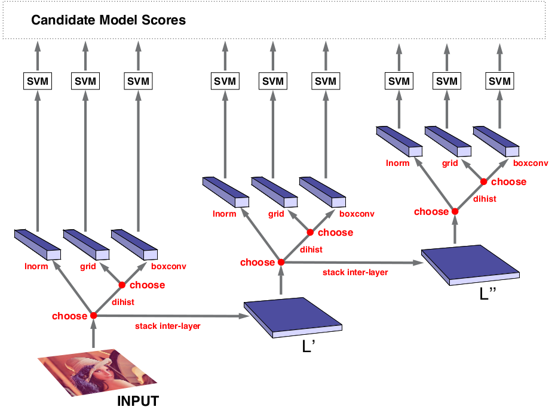

.. Automatic Parameter Optimization slides file, created by
   hieroglyph-quickstart on Tue Jul 29 13:43:01 2014.

Automatic Parameter Optimization
================================

for Professional Python group at TrueCar

August, 2014

ME
====

   - Senior dev/server guy; DevOps
   - 15 years experience with Python
   - john@johntellsall.com

THEME
=====

Programs have lots of configuration where the "best" values are not
obvious. This talk shows how to automatically and efficiently find
optimimal settings under static and dynamic constraints.

Contents
--------

* motivation
* constraints
     static: hardware memory, CPU

     dynamic: avail memory, CPU, other procs

     data: send email to one addr or 1M mailing list

* multiple goals
     min latency

     max throughput

     jitter

     min CPU/memory used

* hyperopt
     example: min(x^2) over x in (-10, 10)

* example: check Python files for errors in parallel
     run "pyflakes" on batch of files, N concurrently

     trick: use Fibonacci series to minimize convergance

* example: Facebook

https://code.facebook.com/posts/816473015039157/making-facebook-s-software-infrastructure-more-energy-efficient-with-autoscale/

* future directions
     capture production info to optimize settings

     be careful: how do you debug a changing system?

.. note::

   https://pypi.python.org/pypi/sphinxcontrib-blockdiag/

motivation
-----------

Let's say you have a bunch of servers doing stuff.  Input servers take requests and do some validation and lookup. Processing servers do the requests, like doing a mail merge of a template with 1000 names and emails.  Output processors take each email and send it to a server.

???

constraints
-----------

     static: hardware memory, CPU

     dynamic: avail memory, CPU, other procs

     data: send email to one addr or 1M mailing list

A workflow isn't a static system.

A specific server has a set amount of CPU and RAM available via
hardware.

If there are other services running on the same server, it'll affect
your service.

Some requests might be higher CPU or memory than others -- so output
wil depend on input.

If a upstream or downstream service is running slower than normal, it
will affect the workload.

optimize end-to-end performance
-------------------------------

     min latency

     max throughput

     jitter

     min CPU/memory used

.. note::

   optional preprocessing

high jitter
--------------

.. image:: _static/uneven-oreo.jpg

low jitter
------------

.. image:: _static/even-cookies.jpg

.. note::

   .. image:: _static/chickenfridaynight.jpg
   .. image:: _static/Chutes-Ladders.jpg
   .. image:: _static/kentucky-roads.jpg
   .. image:: _static/lag-tshirt.jpg
   .. image:: _static/mix-cookie.jpg

how do we satisfy constraints and get nice output?
--------------------------------------------------

   .. image:: _static/audi-cockpit.jpg

uhoh
----

   .. image:: _static/homer-buttons-dials.png

Hyperopt
=================

What is Hyperopt?

hyperopt is a Python library for optimizing over awkward search spaces with real-valued, discrete, and conditional dimensions.

image classification pipeline
-----------------------------

.. note:: 

   Our experiments search a class of image classification
pipelines (c) that include 0, 1, or 2 inter-layers (a), an
outer-layer (b) that extracts features, and a support vector machine
(SVM) classifier. Inter-layers perform filter-bank normalized
cross-correlation (fbncc) and local spatial pooling
(lpool). Outer-layers are similar, but may additionally perform
quadrant pooling and local normalization (lnorm). Hyperparameters
govern the number of inter-layers, the type of outer-layer, and a host
of configuration options within each layer. Although many of the
hyperparameters are mutually exclusive (e.g. only one outer-layer is
active per pipeline) there are 238 hyperparameters in the full search
space.

min(x^2)
--------

.. raw:: html

   <iframe width="800" height="600" frameborder="0" seamless="seamless" scrolling="no" src="https://plot.ly/~johnlmitchell/1/800/600"></iframe>

.. note::
 _static/minx5e2_in_-102c_2b10.svg

.. include:: simple.rst
.. include:: simple2.rst

example: check Python files for errors in parallel
--------------------------------------------------

future directions
-----------------

References
==========

Distributed Asynchronous Hyperparameter Optimization in Python 
http://hyperopt.github.io/hyperopt

SciPy2013 talk
https://github.com/jaberg/hyperopt/wiki/Scipy2013

☃
=
